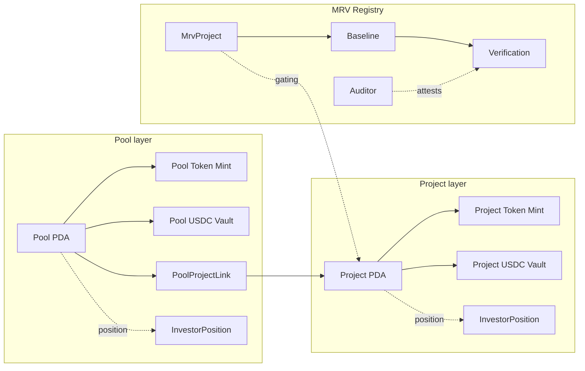

# Exira Contracts

Savings-backed energy-efficiency financing for Indian MSMEs, on Solana.

[](https://explorer.solana.com/?cluster=devnet)
[](https://www.anchor-lang.com)
[](https://www.rust-lang.org)
[](./LICENSE)
[](#live-deployment-devnet)

## Problem and Solution

India's 63 million Micro, Small, and Medium Enterprises (MSMEs) waste roughly 20 to 40 percent of the energy they buy each year because they cannot afford retrofits (efficient motors, VFDs, better boilers, rooftop solar). Banks will not lend unsecured to most MSMEs, and traditional project finance is too expensive for ticket sizes under USD 50,000. The capital gap for MSME efficiency retrofits in India is estimated at over USD 50 billion.

Exira is an on-chain financing rail that lets global investors fund these retrofits, backed by verified energy savings. Investors deposit USDC, receive fractional ownership tokens in a specific MSME project or in a diversified pool, and claim USDC repayments pro-rata as the MSME repays out of the cash saved on its electricity bill. A built-in MRV (Monitoring, Reporting, Verification) registry records auditor-signed baseline consumption and post-retrofit measurements, so every dollar of repayment is tied to a real, measured kilowatt-hour saved.

The contracts implement a two-layer token system, checked-arithmetic pull-based USDC distribution, and a lightweight audit registry. They are live on Solana Devnet and ship with a 92-test integration suite.

## Live Deployment (Devnet)

| Item | Value |
|------|-------|
| Program ID | `J7z1a2bwMEC8MchgZwskJZ8PzXg4UG674VgD8DuotJn2` |
| Deployer / Admin | `AMBKUrFo8LM9psLtppLZBbbXqNU99BQuw9tfeHME2Ltg` |
| Platform PDA | `YugaQS7oCazuuitbSLoDjNGRxpToaAq9cUp4dpXZiZD` |
| USDC Mint (Circle devnet) | `4zMMC9srt5Ri5X14GAgXhaHii3GnPAEERYPJgZJDncDU` |
| Cluster | Devnet |

Explorer links:

- Program on Solana Explorer: https://explorer.solana.com/address/J7z1a2bwMEC8MchgZwskJZ8PzXg4UG674VgD8DuotJn2?cluster=devnet
- Program on Solscan: https://solscan.io/account/J7z1a2bwMEC8MchgZwskJZ8PzXg4UG674VgD8DuotJn2?cluster=devnet
- Deployer on Solana Explorer: https://explorer.solana.com/address/AMBKUrFo8LM9psLtppLZBbbXqNU99BQuw9tfeHME2Ltg?cluster=devnet

## Architecture (High-Level)



Full diagrams and the distribution-math proof are in [docs/ARCHITECTURE.md](./docs/ARCHITECTURE.md).

## Core Concepts

- **PDA-only authorities.** Every project, pool, and position is a Program Derived Address. Vaults and SPL mints are owned by their PDA so that only the program can move funds.
- **Pull-based dividend distribution.** Admin pushes USDC into a vault and updates `cumulative_usdc_per_token`. Investors pull their pro-rata share whenever they want.
- **`PRECISION = 1_000_000_000_000` (1e12).** The cumulative accumulator is stored as `u128` scaled by `PRECISION` to eliminate rounding error across many distributions and many holders.
- **Per-holder `last_claimed_per_token`.** Each `InvestorPosition` remembers the accumulator value at its last claim (or at buy time), so investors only collect their fair share and late buyers cannot claim historical distributions.
- **MRV attestation gating.** A project cannot be created without a `baseline_submitted` MRV entry, tying every financed retrofit to a real-world measurement.

## Prerequisites

| Tool | Version | Notes |
|------|---------|-------|
| Solana CLI (Agave) | 3.1.9 | `solana --version` |
| Rust | 1.95.0 | pinned via [`rust-toolchain.toml`](./rust-toolchain.toml) |
| Anchor | 1.0.0 | install with `avm install 1.0.0 && avm use 1.0.0` |
| Node.js | 20+ | tested on 20.18 |
| Surfpool | 1.2.1 | optional, for the fast local test loop |

All versions align with the current Solana Foundation compatibility matrix at the time of release.

## Quickstart

```bash
git clone https://github.com/nimesh08/exira-contracts.git
cd exira-contracts
npm install
anchor build
```

## Testing

The suite has 92 integration scenarios covering platform init, the full project lifecycle, the full pool lifecycle, the MRV registry, distribution-math invariants, security / authorization, and edge cases. Details in [docs/TESTING.md](./docs/TESTING.md).

Local with [Surfpool](https://docs.surfpool.run) (recommended, fast):

```bash
./scripts/run-tests.sh
```

Local with the stock `solana-test-validator`:

```bash
anchor test
```

Run a single scenario by mocha grep:

```bash
./scripts/run-tests.sh --grep "Distribution math"
```

## Devnet Interaction

The scripts assume `./keys/admin.json` exists and is funded on devnet. The repo ships an empty `keys/` directory; generate a keypair with `solana-keygen new -o ./keys/admin.json` and airdrop via https://faucet.solana.com.

Initialize the platform (one-time per cluster):

```bash
npx tsx scripts/init-devnet.ts
```

End-to-end smoke test (create project, fund, activate, distribute, claim):

```bash
npx tsx scripts/devnet-smoke.ts
```

Buy project tokens with USDC (uses Circle's official devnet USDC):

```bash
npx tsx scripts/devnet-usdc-flow.ts
```

Full deployment walkthrough in [docs/DEPLOYMENT.md](./docs/DEPLOYMENT.md).

## Instructions (summary)

The program exposes 18 instructions. Full parameter and account reference in [docs/INSTRUCTIONS.md](./docs/INSTRUCTIONS.md).

### Admin (8)

| Instruction | Purpose |
|-------------|---------|
| `initialize_platform(orig_bps, perf_bps, hurdle_bps)` | One-time platform setup; stores admin, treasury, USDC mint, fee config. |
| `create_project(id, target, term_months)` | Creates a Project PDA plus its SPL token mint and USDC vault; requires an MRV baseline. |
| `create_pool(id, target)` | Creates a Pool PDA plus its SPL pool-token mint and USDC vault. |
| `add_project_to_pool` | Links a Project into a Pool (up to 20 projects per pool in V1). |
| `activate_project` | Transitions a fully-funded project from Funding to Active; collects the 1.5 percent origination fee to treasury. |
| `distribute_repayment(amount)` | Admin deposits MSME repayment USDC into the project vault and bumps the dividend accumulator. |
| `distribute_pool_returns(amount)` | Same, at the pool layer, for pool token holders. |
| `close_project` | Transitions Active / Repaying to Completed. |

### Investor (5)

| Instruction | Purpose |
|-------------|---------|
| `buy_project_tokens(amount)` | USDC to project tokens, 1:1, while project is Funding. |
| `buy_pool_tokens(amount)` | USDC to pool tokens, 1:1, while pool is Funding. |
| `claim_project_returns` | Pull-claim accrued USDC from a project vault. |
| `claim_pool_returns` | Pull-claim accrued USDC from a pool vault. |
| `withdraw_investment` | Burn project tokens and refund USDC; only while the project is Funding or Cancelled. |

### MRV Registry (5)

| Instruction | Purpose |
|-------------|---------|
| `register_mrv_project(id, msme_name, sector, location, upgrade_type)` | Admin registers a new MRV entry. |
| `add_auditor(name, certification)` | Admin authorizes an auditor wallet. |
| `submit_baseline(...)` | Authorized auditor records pre-retrofit annual energy data. |
| `submit_verification(index, period, savings, ...)` | Authorized auditor records a post-retrofit measurement for a period. |
| `attest_verification` | Submitting auditor signs-off on their own verification. |

## Accounts (summary)

Nine PDA account types. Full layouts, seeds, and `InitSpace` calculations in [docs/ACCOUNTS.md](./docs/ACCOUNTS.md).

| Account | Seeds |
|---------|-------|
| `Platform` | `["platform"]` |
| `Project` | `["project", project_id.to_le_bytes()]` |
| `Pool` | `["pool", pool_id.to_le_bytes()]` |
| `PoolProjectLink` | `["pool_link", pool_pubkey, project_pubkey]` |
| `InvestorPosition` | `["position", target_pubkey, owner_pubkey]` |
| `MrvProject` | `["mrv_project", project_id.to_le_bytes()]` |
| `Baseline` | `["baseline", mrv_project_pubkey]` |
| `Verification` | `["verification", mrv_project_pubkey, [index]]` |
| `Auditor` | `["auditor", wallet_pubkey]` |

## Security and Audit Status

**Devnet only. Not audited. Use at your own risk.**

The program enforces the following checks directly in source:

- Overflow-safe arithmetic everywhere (`checked_add`, `checked_sub`, `checked_mul`, `checked_div`); dedicated `MathOverflow` and `MathUnderflow` error codes.
- Explicit `has_one` authority verification on the Platform PDA for every admin-gated instruction.
- PDA re-derivation (`seeds = [...], bump = account.bump`) on every stored account, preventing PDA spoofing.
- Enum-based state machine guards on status transitions (`ProjectStatus`, `PoolStatus`, `MrvProjectStatus`).
- Account discriminator checks via Anchor's `Account<'info, T>` typed-account wrappers on every account (no raw `AccountInfo` reads of state accounts).
- Pull-based claim invariant: `sum(claims) <= total_distributed` by construction; rounding dust stays in the vault.
- `init` (not `init_if_needed`) on all state PDAs to prevent reinitialization attacks.
- Anchor 1.0.0 duplicate-mutable-account protection enabled by default.

A third-party audit is required before mainnet deployment.

## Project Structure

```
exira-contracts/
├── README.md
├── LICENSE
├── .gitignore
├── Anchor.toml
├── Cargo.toml
├── rust-toolchain.toml
├── package.json
├── tsconfig.json
├── programs/exira/
│   ├── Cargo.toml
│   └── src/
│       ├── lib.rs
│       ├── constants.rs
│       ├── error.rs
│       ├── state/
│       │   ├── platform.rs
│       │   ├── project.rs
│       │   ├── pool.rs
│       │   ├── investor_position.rs
│       │   └── mrv.rs
│       └── instructions/
│           ├── admin/      (8 files)
│           ├── investor/   (5 files)
│           └── mrv/        (5 files)
├── tests/
│   ├── integration/exira_suite.ts
│   ├── helpers/setup.ts
│   └── types/              (generated IDL + TS types)
├── scripts/
│   ├── run-tests.sh
│   ├── init-devnet.ts
│   ├── devnet-smoke.ts
│   └── devnet-usdc-flow.ts
├── app/
│   ├── index.html
│   ├── app.js
│   └── exira.json
├── migrations/deploy.ts
├── docs/
│   ├── ARCHITECTURE.md
│   ├── INSTRUCTIONS.md
│   ├── ACCOUNTS.md
│   ├── TESTING.md
│   └── DEPLOYMENT.md
└── keys/
    └── .gitkeep            (actual keypairs are gitignored)
```

## Roadmap

- Mainnet-readiness hardening (performance-fee enforcement on claim path, pausable / emergency-stop, event emission).
- Third-party security audit.
- Production frontend at https://exira.io with Privy-managed wallets and fiat-to-USDC card on-ramp.
- Pool-signed CPI so pools can buy underlying project tokens directly (V1 uses admin orchestration).
- Secondary-market transferability that migrates `InvestorPosition` state safely.
- Time-locked vesting and cliff periods for treasury / founder allocations.

## Contributing

Contributions welcome. Please open an issue before sending a large PR so we can align on scope. Run `./scripts/run-tests.sh` locally and ensure all 92 tests still pass before opening a PR.

## License

Released under the [MIT License](./LICENSE).

## Acknowledgements

- The [Solana Foundation](https://solana.org) and the Agave validator team.
- The [Anchor](https://www.anchor-lang.com) maintainers.
- [Circle](https://www.circle.com) for USDC on Solana.
- [Surfpool](https://docs.surfpool.run) for the fast local test validator that made the 92-test suite ergonomic.
