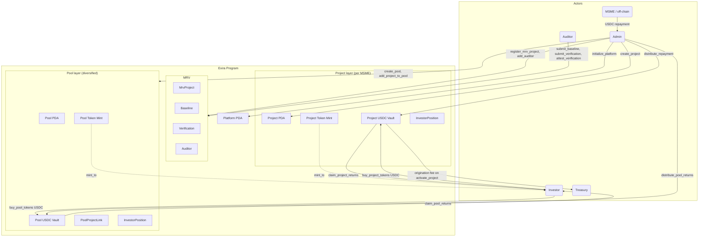

# Architecture

Exira is a Solana program that coordinates three on-chain domains: an MRV (Monitoring, Reporting, Verification) registry that records real-world energy data, a Project layer where investors directly finance a single MSME retrofit, and a Pool layer that wraps a basket of projects into a diversified token. All value transfer is denominated in USDC; all authority is PDA-derived.

## System overview



## Account model

Nine account types, all PDAs. See [ACCOUNTS.md](./ACCOUNTS.md) for exact seed formats, field layouts, and space calculations. Summary of relationships:

- **`Platform`** is a singleton. It holds the admin pubkey, treasury pubkey, accepted USDC mint, fee configuration, and monotonic counters. Every admin-gated instruction uses `has_one = admin` against this account.
- **`MrvProject`** is the registry entry for one real-world MSME retrofit. It carries metadata (name, sector, location, upgrade type) and two boolean gates: `baseline_submitted` and `verification_count`. A `Project` cannot be created unless its referenced `MrvProject.baseline_submitted` is true.
- **`Baseline`** stores pre-retrofit annual energy, fuel cost, and CO2 data plus the SHA-256 hash of the full off-chain report. One baseline per MRV project (enforced by `baseline_submitted` flag).
- **`Verification`** stores a post-retrofit measurement for a period. Each verification carries its own `auditor` pubkey, and only that auditor can flip `attested` to true via `attest_verification`.
- **`Auditor`** is an admin-added registry entry that authorizes a wallet to call `submit_baseline`, `submit_verification`, and `attest_verification`.
- **`Project`** is the core financing unit. It owns its own SPL token mint (for fractional ownership) and a USDC vault ATA. It carries the pull-based accumulator `cumulative_usdc_per_token`.
- **`Pool`** aggregates multiple projects. It owns its own SPL pool-token mint and a USDC vault for pool-level distributions.
- **`PoolProjectLink`** is a join record: one per (pool, project) pair, capacity-capped at 20 per pool in V1 (`MAX_POOL_PROJECTS_V1`).
- **`InvestorPosition`** is one-per-(target, owner), where `target` is either a `Project` PDA or a `Pool` PDA. Stores `tokens_held`, `last_claimed_per_token`, and `total_claimed`. The same address pattern is reused across both layers.

## Token model

Exira mints two independent classes of SPL tokens, all with 6 decimals (matching USDC):

### Project tokens

- Minted by the Project PDA: `mint::authority = project_pda`, `mint::freeze_authority = project_pda`.
- Created inside `create_project` as a fresh `Keypair` passed by the client.
- Issued 1:1 against USDC inside `buy_project_tokens`: each 1 USDC (1,000,000 micro-units) buys exactly 1 project token (1,000,000 micro-units).
- Burned inside `withdraw_investment` (which is only callable while the project is in `Funding` or `Cancelled`).

### Pool tokens

- Minted by the Pool PDA on the same pattern as project tokens.
- Issued 1:1 against USDC inside `buy_pool_tokens`.
- Not burnable in V1.

### USDC vault ownership chain

- Every project's USDC vault is an Associated Token Account with `authority = project_pda`.
- Every pool's USDC vault is an Associated Token Account with `authority = pool_pda`.
- The admin never holds protocol funds: all USDC sits either in an investor's ATA, in a project vault, or in a pool vault, or has been paid out to treasury as origination fee.
- Outbound transfers (claims, withdrawals, origination fee on activation) are PDA-signed CPIs; the admin cannot move vault funds.

## Distribution math

The core invariant is that the sum of all claim amounts is less than or equal to the total amount ever distributed. The program achieves this with a pull-based accumulator scaled by a large fixed `PRECISION` constant.

### Constants

```
PRECISION = 1_000_000_000_000   // 1e12, defined in constants.rs
```

### State per vault (Project or Pool)

- `tokens_sold: u64` : supply of project/pool tokens currently outstanding.
- `total_distributed: u64` : running sum of USDC deposited by `distribute_*`.
- `cumulative_usdc_per_token: u128` : the accumulator, scaled by `PRECISION`.

### State per holder (`InvestorPosition`)

- `tokens_held: u64` : holder's current balance of the relevant token.
- `last_claimed_per_token: u128` : the accumulator value at the time of the holder's last claim or initial buy-in.

### On `distribute_repayment` / `distribute_pool_returns`

```
require(amount > 0)
require(tokens_sold > 0)

delta_per_token = (amount * PRECISION) / tokens_sold     // u128 math
cumulative_usdc_per_token += delta_per_token             // checked_add
total_distributed += amount                              // checked_add
```

Each operation uses `checked_add`, `checked_mul`, `checked_div`, and throws `MathOverflow` / `MathUnderflow` on failure (see `programs/exira/src/error.rs`).

### On `claim_project_returns` / `claim_pool_returns`

```
delta = cumulative_usdc_per_token - last_claimed_per_token   // checked_sub
owed_scaled = tokens_held * delta                            // checked_mul, u128
owed = owed_scaled / PRECISION                               // u64 after try_from

require(owed > 0)                      // else NothingToClaim
require(vault.amount >= owed)          // else InsufficientVaultBalance

vault --(PDA-signed transfer)--> investor_usdc_ata
last_claimed_per_token = cumulative_usdc_per_token
total_claimed += owed
```

### On `buy_project_tokens` / `buy_pool_tokens`

When a new `InvestorPosition` is initialized (`owner == Pubkey::default()`), the handler sets `last_claimed_per_token = cumulative_usdc_per_token` as the starting baseline. This makes it impossible for a late buyer to claim against distributions that happened before their purchase: their delta starts at zero.

When an existing `InvestorPosition` adds tokens via a second buy, `last_claimed_per_token` is NOT reset. Formally this is fine as long as the existing holder claims before buying more (otherwise the new tokens would "inherit" the unclaimed delta from the old position). In practice this is acceptable in V1 because `tokens_held` is tracked separately and the math stays consistent: any unclaimed pre-buy delta gets multiplied across the full post-buy `tokens_held`, giving a mild boost to topped-up holders rather than a loss. A future ix could `auto_claim` before incrementing.

### Why this is correct

- Every call to `distribute_*` adds exactly `amount` USDC to `total_distributed` and exactly `amount * PRECISION / tokens_sold` to the per-token accumulator.
- Every call to `claim_*` pulls exactly `tokens_held * (cum - last) / PRECISION` USDC, which is each holder's share of distributions since their last settlement.
- Summing over all holders of `tokens_held_i * (cum_final - last_i) / PRECISION` gives at most `total_distributed` (strictly less when rounding dust remains).
- The `> / PRECISION` floor on every claim pushes any sub-token-of-USDC dust back into the vault, where it simply raises the next round's effective per-token rate.

Scale: with 6-decimal USDC, `u128`, and `PRECISION = 1e12`, the accumulator can absorb billions of USDC of distributions across billions of tokens without overflow. The tests include a 15-scenario math suite that verifies monotonicity, multi-distribution sums, late-buyer fairness, and rounding behavior.

## MRV registry flow

1. **Admin registers the project.** `register_mrv_project(id, msme_name, sector, location, upgrade_type)` creates an `MrvProject` PDA. Status: `Registered`.
2. **Admin authorizes auditors.** `add_auditor(name, certification)` creates an `Auditor` PDA keyed by the auditor's wallet.
3. **Auditor submits the baseline.** `submit_baseline(energy_kwh, fuel_type, cost_inr, co2_tons, report_hash)` creates a `Baseline` PDA and flips `MrvProject.baseline_submitted = true`. Status: `BaselineSubmitted`. This is the gate that unblocks project creation on the financing side.
4. **Admin creates the Project.** `create_project(id, target, term_months)` enforces `mrv_project.baseline_submitted`; without a baseline the call fails with `MrvBaselineMissing`.
5. **MSME runs, auditor measures.** Every measurement period, the authorized auditor calls `submit_verification(index, period_start, period_end, energy_saved, cost_saved, co2_avoided, savings_vs_expected_bps, report_hash)`. Status becomes `InProgress`.
6. **Auditor attests.** `attest_verification` flips `Verification.attested = true`. The handler enforces `verification.auditor == auditor_signer.key()`, so only the submitting auditor can attest their own work.
7. **Admin repays from savings.** Off-chain, the admin receives USDC from the MSME and calls `distribute_repayment` (or `distribute_pool_returns`). The corresponding attested verification is cited off-chain; the contract does not force a direct on-chain link between a verification and a distribution, but the `report_hash` on each verification and the `total_distributed` counter on each project give auditable evidence.

## Authority model

| Role | On-chain identity | Permissions |
|------|-------------------|-------------|
| Platform admin | `platform.admin` | All admin instructions: `initialize_platform` (once), `create_project`, `create_pool`, `add_project_to_pool`, `activate_project`, `distribute_repayment`, `distribute_pool_returns`, `close_project`, `register_mrv_project`, `add_auditor`. Enforced via `has_one = admin @ Unauthorized`. |
| Treasury | `platform.treasury` | Receives origination fee on `activate_project`. Does not sign instructions; its pubkey is stored in `Platform` and verified with `has_one = treasury`. |
| Auditor | `Auditor.wallet` (PDA-registered) | Submits baselines and verifications, attests own verifications. Enforced via `auditor.wallet == auditor_signer.key()` and `auditor.is_active`. |
| Investor | Any wallet | Buys project/pool tokens, claims returns, withdraws during Funding. Enforced via `position.owner == investor.key()` on claim/withdraw. |

There is no separate "project admin" role in V1; all project administration is by the platform admin.

## Fee model

All fees are read from the `Platform` account and expressed in basis points (10_000 = 100 percent). Defaults, set in `constants.rs`:

| Fee | Default | Where it triggers | Status in V1 |
|-----|---------|-------------------|--------------|
| Origination fee | 150 bps (1.5 percent) | `activate_project` transfers this cut of `target_amount` from the project USDC vault to `treasury_usdc_ata`, PDA-signed. | Enforced. |
| Performance fee | 3000 bps (30 percent) | Intended to take a carry on upside above the hurdle rate in `claim_*`. | Stored in `Platform` but not yet enforced in the claim path in V1. |
| Hurdle rate | 800 bps (8 percent) | Baseline IRR above which the performance fee kicks in. | Stored but not yet enforced. |

The platform itself validates `fee_bps <= MAX_FEE_BPS (10_000)` on `initialize_platform`; any out-of-range value throws `InvalidFeeBps`.
